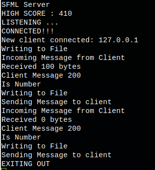

# Personal_Projects

<h2>SFML Engine</h2>

</img> 
</img> 
</img> 
</img> 
</img> 
</img> 
</img> 

</img>

</img>

</img>

<h2>SFML Server</h2>

<h2>Box2D Engine</h2>

<h2>Smart Engine</h2>

<h2>Component Engine</h2>

