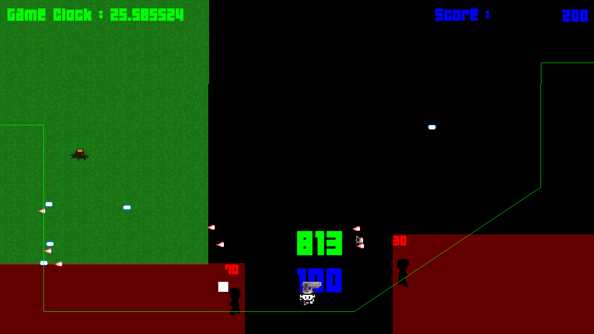

# Personal_Projects
My C++ projects I've developed through my coding journey

<h2>SFML Engine</h2>
The first engine I desined using SFML to create a functional game that allowed the player to navigate between different game states, a physics engine that detects collison between game objects and controlled the players speed using Box2D library, an XML parser to load in assets using tinyXML, and  

</img> 
</img> 

<h2>Box2D Engine</h2>
 My first attempt to build an OpenGL engine and using Box2D as the physics library, such that all the object that were drwan to OpenGL would behave Box2D physics engine. 
 
 
 
</img> 

<h2>Smart Engine</h2>
This is an improvedment from the prior engine that was designed incorporating new techniques such as smart-pointers, and have multiple scenes with different objects drrawn using stacks. Smart-pointers made the code more easier to manage knowing any objects that were allocated would de-allocate once out of scope, and having different scenes added more flexiblilty and helped organaize the code giving a certain purpose to each scene. 

</img> 
</img> 
</img> 

</img>

<h2>Component Engine</h2>
The final addition to the OpenGL engine I created, levearging components allowed the code to become easily managed instead of objects have attributes they inherit components attaches behaviour to game objects giving certain functionality to associated objects. The reorganization of the engine I've designed is efficient with memory resulting in zero memory leaks.

</img>

</img>

